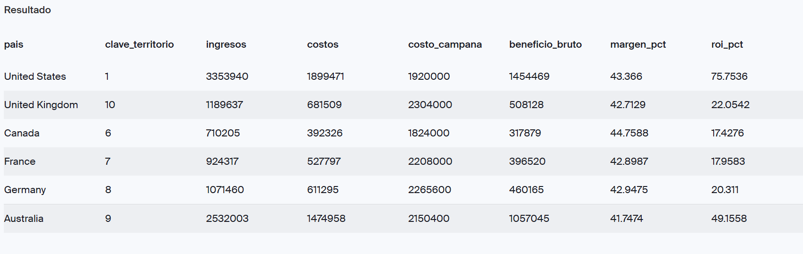
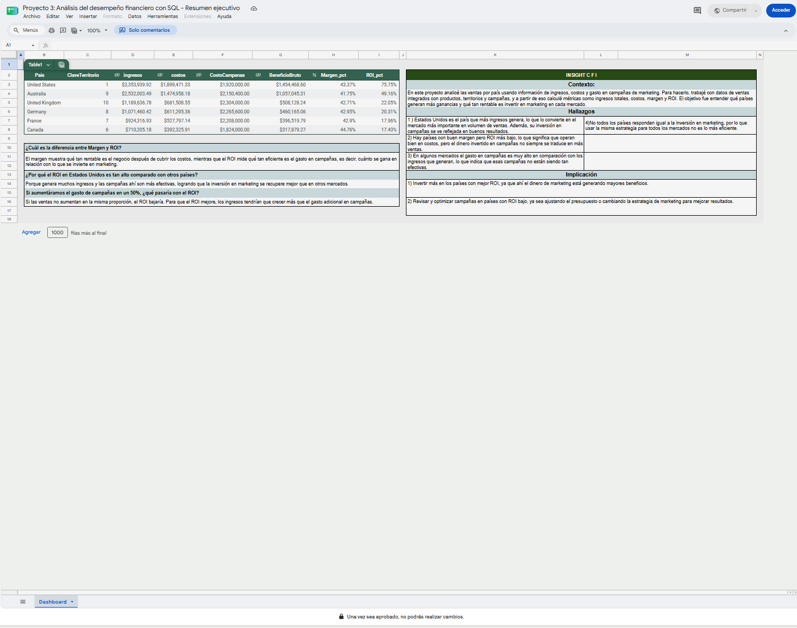

# Desempeño financiero por país con SQL

**Mario Alberto Vivero Sahagún | SQL · Excel · Google Sheets**

Comparación de ventas, costos de producto y gasto de campañas en seis países para identificar qué mercados generan más ingresos y beneficio bruto.

## Pregunta de negocio

¿Qué mercados generan más ingresos y beneficio bruto, y cómo se relaciona ese beneficio con el gasto de campañas registrado?

## Hallazgo clave

- **Estados Unidos lidera** en ingresos (3.35 millones) y en la relación entre beneficio bruto y gasto de campañas (75.75%).
- **Canadá tiene el mayor margen bruto** (44.76%), pero la menor cobertura del gasto de campañas (17.43%).
- **En los seis países, el beneficio bruto es menor que el gasto de campañas registrado.**

**Qué recomiendo:** validar la moneda y el periodo del gasto antes de mover presupuestos, y revisar el desglose por campaña en Canadá y Francia.

## Resultados principales

Resultados históricos de las capturas, redondeados para presentación. Los importes se expresan en unidades monetarias: no se confirmó la moneda ni su homogeneidad entre mercados.

| País | Ingresos aprox. | Margen bruto | Beneficio bruto / campañas |
|---|---:|---:|---:|
| Estados Unidos | 3.35 millones | 43.37% | 75.75% |
| Australia | 2.53 millones | 41.75% | 49.16% |
| Reino Unido | 1.19 millones | 42.71% | 22.05% |
| Alemania | 1.07 millones | 42.95% | 20.31% |
| Francia | 0.92 millones | 42.90% | 17.96% |
| Canadá | 0.71 millones | 44.76% | 17.43% |

- **Estados Unidos lidera en ingresos y en la relación beneficio bruto/gasto de campañas.** Australia ocupa el segundo lugar en ambos indicadores.
- **Canadá tiene el mayor margen bruto**, pero la menor relación entre beneficio bruto y gasto de campañas. El margen del producto y la cobertura del marketing cuentan historias diferentes.
- **En los seis países, el beneficio bruto es menor que el gasto de campañas registrado.** Si ambos corresponden al mismo periodo y alcance, el resultado después de ese gasto sería negativo antes de otros gastos.

### Recomendaciones vinculadas a los resultados

1. Validar moneda, periodo y alcance de la inversión antes de comparar o modificar presupuestos: la relación beneficio/gasto es inferior al 100% en todos los mercados.
2. Revisar el desglose por canal y campaña en Canadá y Francia, los países con menor cobertura del gasto. El agregado por país no permite identificar qué campaña explica el resultado.
3. Usar Estados Unidos y Australia como puntos de comparación para investigar diferencias de volumen, mezcla de productos y gasto. Probar ajustes con medición incremental antes de aumentar la inversión.

## Métricas e interpretación

| Métrica | Cálculo |
|---|---|
| Ingresos | Suma de precio de producto × cantidad |
| Costos de producto | Suma de costo de producto × cantidad |
| Beneficio bruto | Ingresos − costos de producto |
| Margen bruto (%) | Beneficio bruto / ingresos × 100 |
| Beneficio bruto / campañas (%) | Beneficio bruto / gasto de campañas × 100 |

**Aclaración sobre el ROI:** el dashboard original llama `ROI_pct` al último indicador. Esa fórmula no resta el gasto de campañas. Por ello se presenta aquí con un nombre descriptivo y no como ROI neto. Restar 100 puntos porcentuales daría la relación `(beneficio bruto − gasto de campañas) / gasto de campañas × 100`, siempre que periodo y alcance sean comparables. Ninguna de estas relaciones demuestra que las ventas hayan sido causadas por marketing; no se dispone de atribución ni de un grupo de control.

## Datos y proceso

La base incluye `ventas_2017`, `productos`, `productos_categorias`, `territorios` y `campanas`. Las claves de producto, subcategoría y territorio permiten integrar ventas con características del producto y ubicación.

1. Exploración de las cinco tablas.
2. Controles de calidad de claves, cantidades, precios y relaciones.
3. Integración mediante `LEFT JOIN` y cálculo de ingresos y costos.
4. Agregación de ventas y campañas por territorio **antes de unirlas**, para evitar repetir el costo de marketing por cada línea de venta.
5. Cálculo de indicadores con precisión decimal y protección contra división por cero mediante `NULLIF`.

La versión revisada conserva la imputación original de precio, cantidad y costo mediante `COALESCE(..., 0)` y añade una bandera de datos incompletos. Un valor desconocido no equivale necesariamente a cero: cualquier registro marcado debe investigarse antes de interpretar los totales. Los gastos de campaña ausentes se conservan como nulos.

## Calidad de datos y estado de verificación

Las capturas originales muestran **0 nulos** en número de pedido, clave de producto y clave de territorio, y **0 cantidades menores o iguales a cero**.

La comprobación original de precios negativos consultaba por error la cantidad de ventas. La consulta está corregida en el repositorio, pero **su resultado sigue pendiente de ejecución**. También se agregaron controles de unicidad y correspondencia entre tablas, pendientes de ejecución.

El SQL fue reorganizado y revisado a partir del código y las capturas disponibles. **No se ejecutó contra la base original**, que no se incluye en este repositorio. Las capturas son evidencia histórica, no resultados de la versión revisada. Ver [notas metodológicas](docs/notas_metodologicas.md).

## Evidencia visual

### Tabla de KPIs original

La columna `roi_pct` debe interpretarse según la aclaración anterior. Los importes de esta captura SQL están redondeados a enteros.

### Dashboard original en Google Sheets

Captura estática del trabajo original. Sus textos sobre efectividad de campañas y aumento de inversión son hipótesis que el agregado por país no permite confirmar; las recomendaciones revisadas están al inicio de este README.

## Archivos y ejecución

| Archivo | Contenido |
|---|---|
| [01_exploracion_esquema.sql](sql/01_exploracion_esquema.sql) | Exploración inicial |
| [02_validacion_qa.sql](sql/02_validacion_qa.sql) | Controles de calidad y relaciones |
| [03_preparacion_datos.sql](sql/03_preparacion_datos.sql) | Vista temporal de ventas integradas |
| [04_kpis_financieros.sql](sql/04_kpis_financieros.sql) | Agregación y métricas por país y territorio |
| [Notas metodológicas](docs/notas_metodologicas.md) | Supuestos, correcciones y límites |

Para reproducir el análisis se necesita una base compatible con PostgreSQL con las cinco tablas originales y permisos de consulta. Ejecutar los archivos SQL en orden, en **la misma sesión**, ya que la preparación crea una vista temporal. Revisar los resultados del QA antes de continuar; claves repetidas en las dimensiones pueden multiplicar las ventas.

No se incluyen datos originales, credenciales, un dashboard interactivo ni un archivo Excel editable. Las imágenes incluidas son las evidencias disponibles del proyecto.
